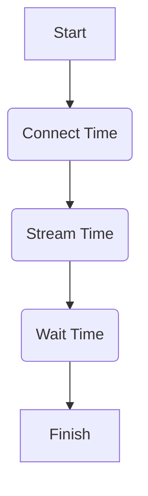

# Hướng dẫn Thiết lập và Sử dụng Voxtral ASR Baseline

Tài liệu này cung cấp hướng dẫn đầy đủ về cách thiết lập server, sử dụng client, và thực hiện quy trình đánh giá chất lượng (evaluation) cho mô hình Voxtral ASR.

## 1. Thành phần Hệ thống

```markdown
- **Server**: Chạy trên Google Colab (`voxtral_baseline.ipynb`) hoặc máy có GPU (Lưu ý: Sau khi chạy cell 1 trên Colab, cần restart runtime và chạy lại). Đặt GITHUB_TOKEN, HF_TOKEN, NGROK_AUTHTOKEN trong .env vào Colab secrets.
```

- **Client (`run_asr.py`)**: Gửi audio và thu thập metrics.
- **Evaluation (`evaluate_metrics.py`)**: Phân tích ảo giác (hallucination) và độ chính xác (CER).
- **LLM Evaluator (`llm_evaluator/`)**: Đánh giá ngữ nghĩa chuyên sâu bằng LLM.

---

## 2. Cấu hình Môi trường (.env)

Trước khi chạy, hãy copy `.env.example` thành `.env` và tùy chỉnh:

| Biến | Mặc định | Ý nghĩa |
| :--- | :--- | :--- |
| `VOXTRAL_HOST` | `localhost` | Ngrok URL hoặc server IP. |
| `VOXTRAL_PORT` | `8000` | Cổng dịch vụ. |
| `VOXTRAL_DELAY` | `480` | Độ trễ xử lý (ms) — *Hiện chỉ mang tính tham khảo*. |
| `VOXTRAL_CHUNK_INTERVAL` | `0.1` | Pacing: `0.1` (realtime), `0` (throughput). |
| `VOXTRAL_RESPONSE_TIMEOUT` | `30` | Timeout chờ transcript sau khi gửi audio. |
| `OPENAI_API_KEY` | `(trống)` | OpenAI API Key cho LLM Evaluator. |
| `OPENAI_API_KEYS` | `(trống)` | Nhiều keys phân tách bằng dấu phẩy (tùy chọn). |

---

## 3. Hướng dẫn Sử dụng Client (`run_asr.py`)

### Danh sách tham số (CLI Flags)

| `--host [url]` | Địa chỉ server (Ngrok URL hoặc IP). Mặc định: `localhost`. |
| `--port [N]` | Cổng dịch vụ. Mặc định: `8000`. |
| `--audio [file]` | Xử lý một file audio duy nhất. |
| `--audio_dir [dir]` | Xử lý toàn bộ file trong thư mục (Batch mode). |
| `--resume [path]` | Tiếp tục chạy batch từ thư mục kết quả (`results/...`). |
| `--chunk-interval [s]` | Khoảng cách gửi chunk: `0.1` (mô phỏng realtime), `0` (tối đa tốc độ). |
| `--delay [ms]` | Cấu hình tham số `transcription_delay_ms` gửi lên server. |
| `--debug` | Bật log chi tiết trạng thái kết nối và keepalive. |
| `--server-audio-dir [dir]` | Thư mục chứa audio trên Colab (để server tự load, không cần stream). |
| `--llm-eval` | Bật đánh giá bằng LLM sau khi chạy xong. |

### Các trường hợp chạy phổ biến

#### 1. Smoke Test (Kiểm tra kết nối nhanh)

```bash
python run_asr.py --audio audio/silence_10s.wav --chunk-interval 0
```

#### 2. Mô phỏng Realtime (Đo Latency thực tế)

```bash
python run_asr.py --audio audio/sample.mp3 --chunk-interval 0.1 --debug
```

#### 3. Chạy Batch kèm LLM Evaluation

```bash
python run_asr.py --audio_dir audio_folder --chunk-interval 0.1 --llm-eval
```

---

## 4. Kiểm thử tiêu chuẩn (Benchmark Modes)

Hệ thống được thiết kế để đo lường qua 3 chế độ:

| Chế độ | Cấu hình | Mục tiêu |
| :--- | :--- | :--- |
| **Realtime Simulation** | `--chunk-interval 0.1` | Đo **Total RTF** (trải nghiệm người dùng cuối). |
| **Throughput Mode** | `--chunk-interval 0` | Đo **Inference RTF** (năng lực xử lý của GPU). |
| **Incremental VAD** | (Mặc định) | Server tự động quét giọng nói để bỏ qua im lặng. |
| **Stress Test** | `--audio_dir [large_set]` | Kiểm tra độ ổn định của tunnel và keepalive. |

---

## 5. Quy trình Đánh giá Chất lượng (`evaluate_metrics.py`)

Công cụ đánh giá giúp tự động hóa việc tính toán các metric như CER, RF, HRS.

### Lệnh chạy đánh giá metrics mẫu

```bash
# So sánh với Ground Truth (tính CER)
python evaluate_metrics.py results/17-04-2026_v1/results.json --gt ground_truth.json --output results/17-04-2026_v1/report.md
```

### Các chỉ số chính (Metrics)

1. **HRS (Hallucination Rate on Silence)**: Số ký tự sinh ra trên mỗi phút im lặng. Mục tiêu: `< 0.5`.
2. **RF (Repetition Factor)**: Số đoạn bị lặp lại vô nghĩa. Mục tiêu: `0`.
3. **CER (Character Error Rate)**: Tỷ lệ lỗi ký tự so với Ground Truth.

---

## 6. Đánh giá chuyên sâu bằng LLM (`llm_evaluator/`)

Module này phát hiện các lỗi ngữ nghĩa (hallucination) mà CER/HRS không bắt được.

### Chạy Đánh giá

**1. Tích hợp trong `run_asr.py`**: Thêm flag `--llm-eval`.

**2. Chạy độc lập (Standalone)**:

```bash
python -m llm_evaluator.batch_runner --results results/17-04-2026_v1/results.json
```

### Kết quả đầu ra (Outputs)

- `llm_eval_details.csv`: Chi tiết từng file.
- `llm_eval_summary.json`: Thống kê tổng hợp.
- `llm_eval_report.md`: Báo cáo Markdown dễ đọc.

---

## 7. Quy trình tối ưu (Tiết kiệm credit Colab)

Để tiết kiệm credit GPU trên Colab, bạn có thể tách bạch quá trình chạy ASR và đánh giá LLM:

### 7.1. Giai đoạn 1: Chạy ASR trên Colab (Lấy kết quả)

- Chạy server trên Colab như bình thường.
- Chạy client local với cờ `--server-audio-dir` để server load file trực tiếp (giảm 99% thời gian chờ stream):

  ```bash
  # Giả sử audio đã được clone vào /content/Voxtral/audio trên Colab
  python run_asr.py --audio_dir audio --server-audio-dir /content/Voxtral/audio --chunk-interval 0
  ```

- Sau khi client báo `Batch complete`, bạn có thể **tắt Runtime Colab** ngay để ngừng tiêu tốn credit.

### 7.2. Giai đoạn 2: Đánh giá LLM tại máy Local

- Sử dụng file `results.json` vừa tạo để chạy đánh giá:

  ```bash
  python -m llm_evaluator.batch_runner --results results/DATE_vX/results.json
  ```

- Quá trình này sử dụng CPU/Network local để gọi OpenAI/Groq API, không phụ thuộc vào Colab.

---

## 8. Sơ đồ Đo lường Latency



- **Inference RTF** = `Wait Time` / `Audio Duration`
- **Total RTF** = `Total Time` / `Audio Duration`

---

## 9. Tự động hóa thử nghiệm (Benchmarking Runner)

Để chạy nhiều lần và lấy kết quả trung bình (ví dụ đo độ ổn định latency), sử dụng `benchmark_runner.py`. Tương tự như quy trình chạy đơn lẻ, bạn có thể chia làm 2 giai đoạn:

> [!IMPORTANT]
> **Về tham số `--host`:**
>
> - **Giai đoạn 1 (Chạy ASR):** **Bắt buộc** phải có `--host` (trỏ đến Ngrok Colab) nếu bạn chưa cấu hình trong file `.env`.
> - **Giai đoạn 2 (Eval-only):** **Không cần** `--host` vì quá trình này chạy local và gọi API công khai (OpenAI/Groq).

### 9.1. Giai đoạn 1: Chạy Batch ASR (Trên Colab)

Để đạt hiệu năng cao nhất và tiết kiệm credit Colab, bạn nên sử dụng cơ chế **load audio trực tiếp trên server** (thay vì stream qua internet).

**Lệnh khuyến nghị (Optimal Path):**
Sử dụng tham số `--server-audio-dir` trỏ tới thư mục audio đã được clone trên Colab.

```bash
# Đường dẫn mặc định trên Colab: /content/voxtral-src/repo/Voxtral/audio
python benchmark_runner.py --audio_dir audio --server-audio-dir /content/voxtral-src/repo/Voxtral/audio --runs 10 --chunk-interval 0 --host https://your-ngrok.ngrok-free.app/
```

> [!TIP]
> **Tại sao cần cả `--audio_dir` và `--server-audio-dir`?**
>
> - `--audio_dir audio`: Giúp script local biết danh sách các file cần chạy (quét tên file trong thư mục `audio` local).
> - `--server-audio-dir /content/...`: Ra lệnh cho server tìm file tương ứng ngay trên ổ cứng của nó.
> - `--chunk-interval 0`: Ở chế độ này, 0 là giá trị tối ưu nhất để đo tốc độ xử lý thuần túy (Throughput).

**Trường hợp chạy Streaming (Không khuyến nghị cho batch lớn):**
Nếu bạn không có sẵn audio trên server, bạn có thể chạy streaming (chậm hơn và phụ thuộc vào tốc độ upload):

```bash
python benchmark_runner.py --audio_dir audio --runs 10 --chunk-interval 0.1 --host https://your-ngrok.ngrok-free.app/
```

### 9.2. Giai đoạn 2: Đánh giá LLM & Tổng hợp (Tại Local)

Sử dụng cờ `--eval-only` và `--run-dirs` để quét các thư mục kết quả đã tạo và chạy đánh giá LLM hàng loạt:

```bash
# Trường hợp 1: Chạy toàn bộ version của một ngày (Cách 1 - dùng --date)
python benchmark_runner.py --eval-only --date 18-04-2026 --llm-eval

# Trường hợp 2: Chạy toàn bộ version của một ngày (Cách 2 - dùng glob)
python benchmark_runner.py --eval-only --run-dirs "results/18-04-2026_v*" --llm-eval

# Trường hợp 3: Quét các folder kết quả trong một khoảng version (từ v3 đến v6)
python benchmark_runner.py --eval-only --run-dirs "results/18-04-2026_v*" --start-v 3 --end-v 6 --llm-eval
```

### Các tham số đặc thù của Runner

| Cờ | Ý nghĩa |
| :--- | :--- |
| `--runs [N]` | Số lần lặp lại (dùng cho Giai đoạn 1). |
| `--eval-only` | Chỉ chạy đánh giá/tổng hợp (dùng cho Giai đoạn 2). |
| `--run-dirs [glob]` | Mẫu đường dẫn các folder kết quả (ví dụ: `"results/DATE_v*"`). |
| `--start-v [N]` | Số phiên bản bắt đầu (ví dụ: `3`). |
| `--end-v [N]` | Số phiên bản kết thúc (ví dụ: `6`). |

Sau khi hoàn tất, script sẽ tạo file tổng hợp trong thư mục `benchmarks/benchmark_TIMESTAMP.json` chứa thông số trung bình của tất cả các lần chạy thành công.

---

## 10. Giải quyết vấn đề (Troubleshooting)

- **[Timeout]**: Inference quá lâu. Tăng `--response-timeout`.
- **[Client Error]**: Kiểm tra `.env` và URL server.
- **[Inference Error]**: Xem log server tại `/tmp/voxtral_server.log`.
- **`--server-audio-dir` trả transcript rỗng**:
  - Xác minh Colab đang chạy đúng revision bằng dòng `[startup] fingerprint:` trong `/tmp/voxtral_server.log`.
  - Phiên bản hiện tại (v1.2) phải hiện `version:2026-04-24.1`.
  - Nếu thấy log `VAD: silence detected, skipping inference` thì đây là hành vi đúng (không có tiếng nói).
  - Nếu log WebSocket không có `message_received  type='input_audio_buffer.from_path'`, frame `from_path` chưa tới server.
  - Nếu có `message_received ... from_path` nhưng không có `loading_from_path`, kiểm tra `unknown_message_type`.
  - Nếu có `loading_from_path` nhưng fail, đối chiếu `path_not_found` hoặc `load_error` để phân biệt sai path và lỗi decode/file.

---
*Cập nhật bởi Voxtral Audit Team - 18/04/2026*
