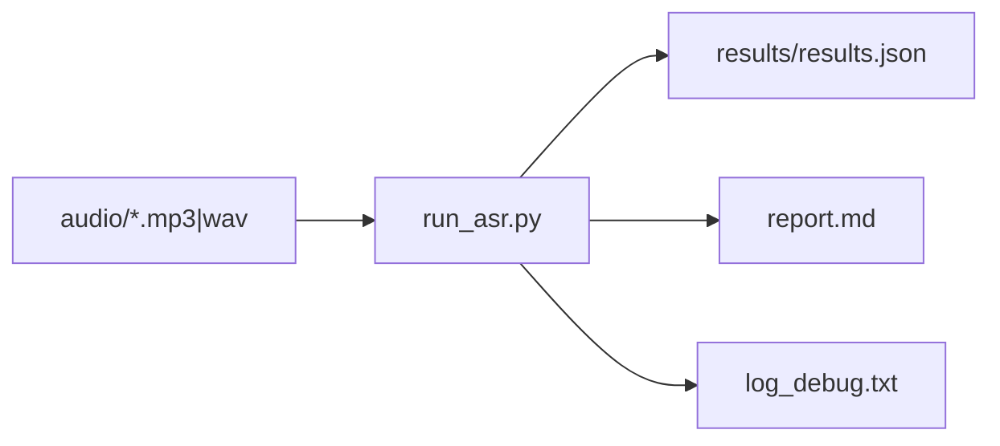

# Phương pháp và Kế hoạch Đánh giá Hallucination (LLM-as-a-Judge)

| Thông tin | Chi tiết |
| :--- | :--- |
| **Tên file** | `llm_based_hallucination_evaluation_plan.md` |
| **Mục đích** | Phác thảo kiến trúc, prompt schema và kế hoạch dùng LLM để đánh giá hallucination |
| **Ngày tạo** | 2026-04-17 |
| **Cập nhật** | 2026-04-18 (v2 — revised and implemented) |
| **Trạng thái** | Implemented |

---

## 1. Bối cảnh và Đặc điểm Dữ liệu Thực tế

### 1.1. Kiến trúc Pipeline hiện tại

Hệ thống Voxtral ASR hoạt động theo luồng:



Báo cáo (`report.md`) hiện sinh tự động qua `evaluate_metrics.py`, tính toán các metrics:

- **HRS** (Hallucination Rate on Silence): chars/phút trong file im lặng/noise
- **RF** (Repetition Factor): đếm N-gram lặp liên tiếp
- **CER** (Character Error Rate): so sánh transcript với `ground_truth.json`
- **RTF** (Real-Time Factor): `inference_rtf = wait_after_commit / duration`

### 1.2. Định dạng Output thực tế của Hệ thống (Hypothesis)

> [!IMPORTANT]
> Output của Voxtral ASR **KHÔNG có timestamp**. Kết quả là một chuỗi `transcript` thuần túy (plain text), được trả về qua sự kiện WebSocket `response.audio_transcript.done`.

Ví dụ từ `results/17-04-2026_v2/results.json`:

```json
{
    "file": "media_148280_1767762915627.mp3",
    "status": "success",
    "transcript": "ありがとうございます。アセットジャパンです。...",
    "duration": 80.08,
    "inference_rtf": 1.193,
    "rf": 0,
    "cer": "65.49%"
}
```

### 1.3. Định dạng Ground Truth

| Nguồn | File | Định dạng | Dùng cho |
| :--- | :--- | :--- | :--- |
| **GT Timestamped** | `timestamps/<filename>.txt` | `[start - end] SPEAKER: text` | 1. Tính CER (reconstructed). 2. Cung cấp ngữ cảnh cho LLM. |

Ví dụ file `timestamps/media_148280_1767762915627.txt`:

```text
[1.349 - 3.426] SPEAKER 1: はい、ありがとうございます。アセットジャパンです。
[4.796 - 9.287] SPEAKER 2: お世話になっております。 私バルテスの中岡と申申しあげます。
[9.293 - 10.428] SPEAKER 1: はい、お世話になります。
...
```

### 1.4. Khoảng trống của metrics hiện tại

Các metrics hiện tại (`HRS`, `RF`, `CER`) chỉ phát hiện được:

- ✅ Hallucination khi im lặng tuyệt đối (HRS)
- ✅ Lặp từ cơ học (RF)
- ✅ Sai lệch tổng thể so với GT (CER)

Nhưng **không thể phát hiện**:

- ❌ **Content Replacement**: Transcript hoàn toàn bịa ra nội dung mới (CER cao nhưng không biết lý do)
- ❌ **Semantic Insertion**: Thêm từ ngữ lịch sự/đệm không có trong GT nhưng ngữ cảnh bình thường
- ❌ **Classification of error type**: CER cao vì ghi sai ("バルテス" → "バビブベボ") khác với hallucination thực sự
- ❌ **Phân loại severity**: Không biết lỗi nghiêm trọng hay chấp nhận được

---

## 2. Mục tiêu Đánh giá

### 2.1. Nguyên lý So sánh Bất đối xứng (Asymmetric Comparison)

> [!NOTE]
> Vì HYP là plain transcript và GT có timestamp, LLM **không thể so sánh timestamp-to-timestamp trực tiếp**. Thay vào đó, LLM phải thực hiện **Asymmetric Comparison**: dùng GT timestamped làm reference frame để đánh giá xem nội dung trong HYP có nhất quán, có bịa đặt, hay bị biến đổi so với những gì diễn ra trong audio không.

Quy trình suy luận của LLM:

1. **Parse GT**: Tái cấu trúc timeline từ các phân đoạn `[start - end] SPEAKER: text` → hiểu rõ ai nói gì, vào lúc nào
2. **Đọc HYP**: Nhận toàn bộ transcript là một chuỗi liên tục
3. **So sánh nội dung**: Kiểm tra HYP có chứa thông tin không có trong GT (insertion), thay thế thông tin (content replacement), hay lặp lại vô nghĩa (repetition)

---

## 3. Kiến trúc Hệ thống Evaluator

Cấu trúc thư mục triển khai:

```text
llm_evaluator/
├── __init__.py
├── data_loader.py        # Đọc results.json + timestamps/ + ground_truth.json
├── prompt_builder.py     # Xây dựng prompt từ GT timestamped + HYP plain text
├── llm_caller.py         # Gọi API (OpenAI/Gemini/Anthropic)
├── schema.py             # Pydantic models cho structured output
├── batch_runner.py       # Async batch processing
└── report_exporter.py    # Xuất CSV, JSON, summary Markdown
```

### 3.1. Data Loader & Tiền xử lý

Đọc và ghép cặp dữ liệu từ:

- `results/<run_dir>/results.json` → danh sách `{ file, transcript, cer, rf, rtf, ... }`
- `timestamps/<filename>.txt` → GT có timestamp (nếu tồn tại)
- `ground_truth.json` → GT plain text

Kết quả: danh sách `EvaluationCandidate`:

```python
@dataclass
class EvaluationCandidate:
    filename: str
    hyp_transcript: str          # Plain text từ results.json
    gt_timestamped: str | None   # Nội dung file timestamps/*.txt
    gt_plain: str | None         # Từ ground_truth.json
    existing_cer: str | None     # CER đã tính sẵn (dạng string %)
    existing_rf: int             # RF đã tính sẵn
    existing_hrs: float          # HRS của batch
```

**Logic ưu tiên và Tiền xử lý**:

- **Matching**: Filename trong `results.json` có thể chứa khoảng trắng (ví dụ: `media... (1).mp3`), trong khi file hệ thống/timestamps có thể đã được normalize (ví dụ: `media..._(1).txt`). Data Loader cần logic fuzzy matching hoặc normalize tên file (lowercase, remove spaces/parentheses) để ghép cặp chính xác.
- **Normalization**: Sử dụng lại hàm `normalize_japanese` từ `evaluate_metrics.py` để làm sạch cả HYP và GT trước khi đưa vào LLM (loại bỏ dấu câu, khoảng trắng thừa) giúp LLM tập trung vào nội dung chính.
- **Context Injection**: Sử dụng `timestamps/*.txt`. Evaluator sẽ tự động tách phần transcript để tính CER reference và dùng toàn bộ file (kèm timestamp/speaker) để làm reference frame cho LLM evaluation.

### 3.2. Prompt Builder (GT-Timestamped-Aware)

```text
[SYSTEM]
Bạn là chuyên gia đánh giá chất lượng ASR tiếng Nhật.
Nhiệm vụ: So sánh transcript từ hệ thống ASR (Hypothesis) với Ground Truth 
để phát hiện các dạng hallucination.

QUAN TRỌNG: Hypothesis là plain text (KHÔNG có timestamp).
Ground Truth có timestamp [start - end] SPEAKER: text — đây là NGUỒN SỰ THẬT.

Quy trình phân tích:
1. Đọc và hiểu timeline từ Ground Truth (ai nói gì, vào lúc nào).
2. Đọc toàn bộ Hypothesis.
3. Xác định xem Hypothesis có chứa nội dung không xuất hiện trong GT không.
4. Xác định xem có đoạn nào trong GT bị Hypothesis bỏ qua, thay thế, hoặc bóp méo không.
5. So sánh dựa trên nội dung đã được normalize (loại bỏ dấu câu/khoảng trắng) để tránh bắt lỗi trình bày.

Phân loại lỗi:
- silence_text: HYP sinh chữ tại đoạn mà GT không có bất kỳ lời nói nào (khoảng trống trong timeline).
- repetition: Lặp từ/cụm từ vô nghĩa mà GT không có.
- insertion: HYP thêm từ ngữ/câu không có trong GT (không phải paraphrase).
- content_replacement: HYP thay thế nội dung GT bằng nội dung hoàn toàn khác.

Chỉ trả về JSON, không có text nào khác.

[USER]
Ground Truth (có timestamps):
{gt_timestamped_content}

Hypothesis (plain transcript):
{hyp_transcript}

Trả về JSON theo schema yêu cầu.
```

**Xử lý trường hợp không có GT timestamped:**

```text
[SYSTEM - No-GT Mode]
Bạn là chuyên gia đánh giá ASR tiếng Nhật.
Không có Ground Truth để so sánh. Hãy phân tích NỘI TẠI của Hypothesis để phát hiện:
- Lặp từ vô nghĩa (repetition)
- Độ dài bất thường so với thời lượng audio ({duration}s)
- Chuyển ngôn ngữ đột ngột (ví dụ: từ tiếng Nhật sang tiếng Anh)
- Câu chào hỏi xã giao generic không phù hợp với ngữ cảnh

Hypothesis:
{hyp_transcript}

Chỉ trả về JSON.
```

### 3.3. JSON Schema (Pydantic)

```python
from pydantic import BaseModel, Field
from typing import Literal

class EvaluationResult(BaseModel):
    filename: str
    has_hallucination: bool
    primary_error: Literal[
        "silence_text", "repetition", "insertion", 
        "content_replacement", "none"
    ] = "none"
    evidence_hyp_text: str | None = Field(
        None,
        description="Đoạn text TRONG HYP là bằng chứng của hallucination"
    )
    evidence_gt_context: str | None = Field(
        None,
        description="Đoạn GT tương ứng (kèm timestamp nếu có) để đối chiếu"
    )
    severity: Literal["high", "medium", "low", "none"] = "none"
    confidence: Literal["high", "medium", "low"] = "low"
    review_status: Literal["auto_accept", "manual_review"] = "auto_accept"
    reasoning: str = Field(description="Giải thích ngắn gọn tại sao chọn nhãn này")
    
    # Inherited metrics từ pipeline hiện tại
    existing_cer: str | None = None
    existing_rf: int = 0
```

> [!NOTE]
> Field `evidence_hyp_text` thay thế `evidence_timestamp` trong phiên bản cũ. Vì HYP không có timestamp, LLM trích đoạn text cụ thể trong HYP thay vì time interval.

### 3.4. LLM Caller (Async)

```python
import asyncio
import openai

async def evaluate_single(candidate: EvaluationCandidate, client, model="gpt-4o") -> EvaluationResult:
    prompt = build_prompt(candidate)
    response = await client.beta.chat.completions.parse(
        model=model,
        messages=[
            {"role": "system", "content": prompt["system"]},
            {"role": "user", "content": prompt["user"]}
        ],
        response_format=EvaluationResult,
        temperature=0.0  # Deterministic
    )
    return response.choices[0].message.parsed

async def evaluate_batch(candidates: list[EvaluationCandidate], model="gpt-4o") -> list[EvaluationResult]:
    client = openai.AsyncOpenAI()
    tasks = [evaluate_single(c, client, model) for c in candidates]
    return await asyncio.gather(*tasks)
```

### 3.5. Batch Aggregator & Exporter

Thu thập kết quả và xuất ra:

| Output File | Nội dung |
| :--- | :--- |
| `llm_eval_details.csv` | Kết quả từng file (tất cả fields) |
| `llm_eval_summary.json` | Tổng hợp: tỷ lệ hallucination, phân bố severity, count by error type, manual_review_rate |
| `llm_eval_report.md` | Report dạng Markdown human-readable, có thể commit vào repo |

**Cấu trúc `summary.json`:**

```json
{
    "run_dir": "results/17-04-2026_v2",
    "model_used": "gpt-4o",
    "total_files": 11,
    "evaluated_files": 9,
    "hallucination_rate": 0.44,
    "manual_review_rate": 0.22,
    "error_distribution": {
        "content_replacement": 2,
        "insertion": 1,
        "repetition": 0,
        "silence_text": 1,
        "none": 5
    },
    "severity_distribution": {
        "high": 1,
        "medium": 2,
        "low": 1,
        "none": 5
    },
    "existing_metrics": {
        "avg_cer": "45.03%",
        "avg_inference_rtf": 1.890,
        "hrs": 0.0
    }
}
```

---

## 4. Mapping LLM Evaluation với Metrics Hiện tại

LLM evaluation **bổ sung** cho pipeline hiện tại, không thay thế:

| Metric | Nguồn | Phát hiện |
| :--- | :--- | :--- |
| **HRS** | `evaluate_metrics.py` | Hallucination khi im lặng tuyệt đối |
| **RF** | `evaluate_metrics.py` | Lặp N-gram cơ học |
| **CER** | `evaluate_metrics.py` | Sai lệch tổng thể với GT |
| **LLM `has_hallucination`** | `llm_evaluator/` | Phán quyết semantic, cross-validate với CER |
| **LLM `primary_error`** | `llm_evaluator/` | Phân loại loại lỗi |
| **LLM `severity`** | `llm_evaluator/` | Mức độ ảnh hưởng |

**Correlation heuristic**: Nếu `cer > 50%` và LLM đánh giá `has_hallucination=False` → flag để manual review (có thể LLM nhầm hoặc GT không chính xác).

---

## 5. Kế hoạch Triển khai (Roadmap)

### Bước 1 (Day 1): Framework lõi

- Tạo `llm_evaluator/` trong gốc repo (hiện đang **rỗng**)
- Viết `schema.py` với Pydantic models
- Viết `data_loader.py`: load `results.json`, ghép với `timestamps/`, `ground_truth.json`
- Cấu hình API key (`.env` đã có sẵn)

### Bước 2 (Day 1-2): Prompt Engineering & Calibration

- Chọn 5 file mẫu từ `results/17-04-2026_v2/` để test:
  - 2 file CER thấp (clean): `media_148284` (15.77%), `media_148393` (17.55%)
  - 3 file CER cao (suspected hallucination): `media_148414` (100%), `media_149291` (97.80%), `media_148280` (65.49%)
- Test cả 2 mode: có GT timestamped và No-GT mode
- Tinh chỉnh prompt và chain-of-thought reasoning

### Bước 3 (Day 2): Batch Pipeline & Integration

- Viết `batch_runner.py` với async API calls
- Tích hợp vào `run_asr.py`: sau khi generate `report.md`, tự động chạy LLM evaluation nếu có `--llm-eval` flag
- Sinh `llm_eval_details.csv`, `llm_eval_summary.json`, `llm_eval_report.md`

### Bước 4 (Day 3): CI/CD & Baseline

- Chạy LLM evaluation trên toàn bộ `results/17-04-2026_v2/`
- Lưu `llm_eval_summary.json` làm baseline để so sánh với các lần chạy sau
- Kiểm tra correlation giữa `cer` và `has_hallucination` → tìm ngưỡng CER thích hợp

---

## 6. Chi phí và Lựa chọn Model

| Model | Giá (input/output) | Structured JSON | Khuyến nghị |
| :--- | :--- | :--- | :--- |
| **GPT-4o** | ~$2.5 / $10 per 1M tokens | Native (`.parse()`) | ✅ Production |
| **GPT-4o-mini** | ~$0.15 / $0.6 per 1M tokens | Native | ✅ Cost thấp, test |
| **Gemini 1.5 Pro** | ~$1.25 / $5 per 1M tokens | JSON mode | ✅ Thay thế |
| **Claude 3.5 Sonnet** | ~$3 / $15 per 1M tokens | Tool use | ⚠️ Phức tạp hơn |

Ước tính chi phí: Với 11 file, mỗi prompt ~1500 tokens → tổng ~16,500 tokens/batch → **< $0.01 với GPT-4o-mini**.

---

## 7. Kết luận

LLM-as-a-Judge **bổ sung** vào pipeline đánh giá hiện tại ở tầng semantic, giải quyết các trường hợp mà metrics heuristic (HRS, RF, CER) không thể phân loại. Kiến trúc được thiết kế phù hợp với thực tế:

- HYP là **plain transcript** (không có timestamp) → LLM dùng GT timestamped làm reference frame
- Tích hợp chặt với pipeline hiện tại: thêm vào sau `evaluate_metrics.py`
- Pydantic structured output đảm bảo JSON parsing deterministic
- Không thay thế metrics hiện tại, mà cross-validate để tăng độ tin cậy
