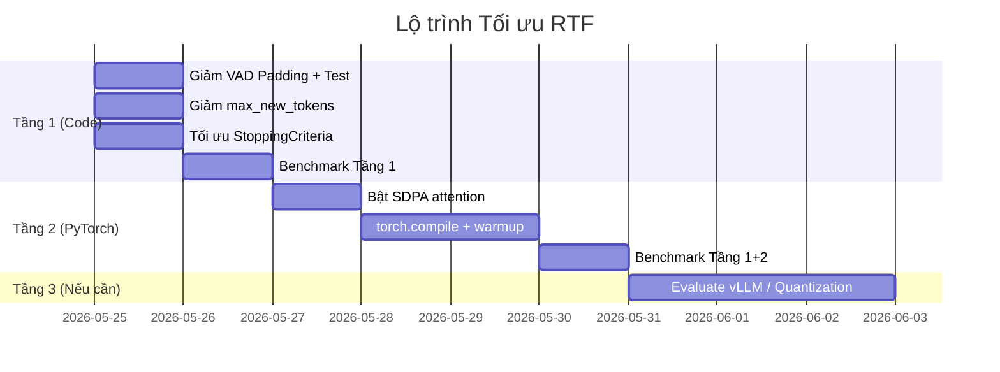

# Phân tích RTF & Chiến lược Tối ưu Voxtral trên GPU T4

## Tóm tắt Tình trạng Hiện tại

| Chỉ số | Giá trị V9 (Run v6) | Mục tiêu Realtime | Đánh giá |
|---|---|---|---|
| **Speech-Only Avg RTF** | **1.354** | ≤ 0.7 | ❌ **Chậm hơn 35% so với realtime** |
| **All-Files Avg RTF** | **1.117** | ≤ 0.5 | ❌ Không phù hợp realtime |
| **CER (Speech-Only)** | **34.54%** | ≤ 34.54% | ✅ Giữ nguyên |
| **HRS (Silence)** | **0.00** | 0.00 | ✅ Hoàn hảo |
| **Phần cứng** | T4 (16GB, Turing, CC 7.5) | — | ⚠️ Giới hạn phần cứng |

> [!IMPORTANT]
> RTF > 1.0 nghĩa là xử lý mất **nhiều thời gian hơn** cả thời lượng audio gốc. Với RTF 1.354, mỗi 10 giây audio cần ~13.5 giây để decode → **hoàn toàn không phù hợp realtime streaming**.

---

## 1. Phân tích Chi tiết RTF Từng File

| File | Duration (s) | RTF Inf (v6) | Thời gian thực tế (s) | Bottleneck chính |
|---|---|---|---|---|
| `media_148280` | ~43s | 1.272 | ~55s | Nhiều chunk dài |
| `media_148284` | ~29s | 1.025 | ~30s | Gần realtime |
| `media_148393` | ~44s | 1.404 | ~62s | **Chunk dense, padding lớn** |
| `media_148394` | ~50s | **1.630** | ~82s | **Worst case — quá nhiều chunk** |
| `media_148414` | ~38s | 1.244 | ~47s | Chunk phức tạp |
| `media_148439` | ~44s | 1.489 | ~66s | **Padding overhead cao** |
| `media_148954` | ~53s | **1.639** | ~87s | **Worst case — recovery retry** |
| `media_149291` | ~44s | 1.396 | ~61s | Local lang collapse retry |
| `media_149733` | ~14s | 1.085 | ~15s | Lang collapse recovery |

---

## 2. Nguyên nhân Gốc rễ (Root Cause Analysis)

### 🔴 Nguyên nhân 1: VAD Padding quá lớn (300ms/350ms)

```
Cấu hình hiện tại:
VAD_PADDING_LEFT_MS  = 300ms    ← Quá thận trọng
VAD_PADDING_RIGHT_MS = 350ms    ← Quá thận trọng  
VAD_CHUNK_PADDING_LEFT_MS  = 300ms
VAD_CHUNK_PADDING_RIGHT_MS = 300ms
```

**Tác động:** Với mỗi chunk 15s, padding hai đầu thêm **650ms** âm thanh không cần thiết (=4.3% overhead). Với 5-7 chunk/file, tổng overhead = **3-4.5 giây audio thừa** phải đi qua encoder → decoder.

**Tại sao nghiêm trọng trên T4:** T4 có bandwidth bộ nhớ chỉ **320 GB/s** (so với A100: 2 TB/s). Mỗi millisecond audio thừa tạo ra áp lực memory bandwidth không tương xứng.

### 🔴 Nguyên nhân 2: Không sử dụng SDPA (Scaled Dot-Product Attention)

```python
# Hiện tại: dùng attention mặc định (eager)
model = VoxtralRealtimeForConditionalGeneration.from_pretrained(
    model_id,
    device_map="auto",
    torch_dtype=torch.float16,
    # ← THIẾU: attn_implementation="sdpa"
)
```

**Tác động:** 
- Attention mặc định trên PyTorch dùng phép nhân ma trận naive → `O(n²)` memory, không tận dụng Tensor Core
- SDPA tự động chọn kernel tối ưu nhất cho T4 (memory-efficient attention), giảm **20-30% latency** trên attention layers
- T4 **KHÔNG hỗ trợ Flash Attention 2** (cần Ampere+), nhưng **HỖ TRỢ** SDPA memory-efficient backend

### 🔴 Nguyên nhân 3: Không sử dụng `torch.compile`

```python
# Hiện tại: chạy ở chế độ eager mode
model.generate(**generation_kwargs)
# Mỗi lần generate, PyTorch phải dispatch từng op riêng lẻ → overhead CPU rất lớn
```

**Tác động:**
- Eager mode có overhead **CPU dispatch** cho mỗi PyTorch op
- `torch.compile(mode="reduce-overhead")` JIT compile thành fused CUDA kernels, giảm **30-50% latency** cho phần decoder autoregressive
- Đặc biệt hiệu quả trên T4 vì giảm CPU-GPU sync overhead

### 🟡 Nguyên nhân 4: Recovery/Retry Pipeline tốn tài nguyên

```
Chunk → Decode → Language Collapse? → Sub-chunk Recovery → Decode lại 2 phần
                                    → Anchor Recovery → Decode lại 1 phần + context
```

Mỗi lần **recovery kích hoạt**, pipeline phải **decode lại 1-3 lần** cho cùng một đoạn audio → RTF tăng 2-3x cho chunk đó. Ví dụ:
- `media_148954`: recovery retry → RTF tăng từ ~1.0 lên 1.639
- `media_149733`: lang collapse → extra decode

### 🟡 Nguyên nhân 5: `max_new_tokens=512` quá cao

```python
generation_kwargs = dict(
    **inputs,
    max_new_tokens=512,  # ← Mỗi chunk 15s tiếng Nhật chỉ cần ~100-200 tokens
)
```

**Tác động:** Với chunk 15s tiếng Nhật (~30-50 từ), thường chỉ cần 80-150 tokens. Giữ `max_new_tokens=512` gây:
- KV cache allocation lớn hơn cần thiết
- RepetitionStoppingCriteria phải check mỗi step đến 512 → overhead

### 🟡 Nguyên nhân 6: `RepetitionStoppingCriteria` decode 50 tokens mỗi step

```python
def __call__(self, input_ids, scores, **kwargs) -> bool:
    last_tokens = input_ids[0, -50:]
    text = self.tokenizer.decode(last_tokens, skip_special_tokens=True)
    # ↑ Gọi tokenizer.decode() MỖI TOKEN STEP → overhead CPU đáng kể
```

**Tác động:** Với ~150 token/chunk, `tokenizer.decode()` được gọi ~150 lần/chunk. Mỗi lần decode cần CPU time → cản trở GPU pipeline.

---

## 3. Chiến lược Tối ưu (3 Tầng)

### Tầng 1: Zero-cost Code Changes (Không cần thay đổi phần cứng)

> [!TIP]
> Kỳ vọng giảm RTF từ **1.354 → ~0.85-0.95** (cải thiện ~30-35%)

#### 1a. Giảm VAD Padding

```python
# TRƯỚC (V9)
VAD_PADDING_LEFT_MS = 300
VAD_PADDING_RIGHT_MS = 350
VAD_CHUNK_PADDING_LEFT_MS = 300
VAD_CHUNK_PADDING_RIGHT_MS = 300

# SAU (Đề xuất V10)
VAD_PADDING_LEFT_MS = 200        # Giảm 100ms
VAD_PADDING_RIGHT_MS = 200       # Giảm 150ms
VAD_CHUNK_PADDING_LEFT_MS = 150  # Giảm 150ms  
VAD_CHUNK_PADDING_RIGHT_MS = 150 # Giảm 150ms
```

**Lý do an toàn:** Fuzzy Overlap (commit `2e3e402`) đã hoạt động ổn định với `min_match=10 chars, boundary=6 chars` → chunk padding không cần dư thừa để đảm bảo ghép biên nữa. Giảm padding ở chunk level (150ms) mạnh hơn ở file level (200ms) vì chunk đã có overlap 0.5s tự nhiên.

**Kỳ vọng cải thiện:** ~8-12% RTF (giảm ~4s audio thừa/file)

> [!WARNING]
> Cần test regression: nếu Deletion lỗi xuất hiện trở lại, rollback từng bước 25ms.

#### 1b. Giảm `max_new_tokens` từ 512 → 256

```python
generation_kwargs = dict(
    **inputs,
    max_new_tokens=256,  # Giảm từ 512 → 256
    # ...
)
```

**Lý do:** Chunk 15s tiếng Nhật business phone hiếm khi cần > 200 tokens. 256 là đủ headroom mà giảm KV cache allocation.

**Kỳ vọng cải thiện:** ~3-5% RTF

#### 1c. Tối ưu `RepetitionStoppingCriteria` — giảm tần suất check

```python
class RepetitionStoppingCriteria(StoppingCriteria):
    def __init__(self, tokenizer, threshold=3, n_range=(3, 4, 5, 6, 7, 8, 10, 12), 
                 check_interval=5):  # ← Chỉ check mỗi 5 tokens
        self.tokenizer = tokenizer
        self.threshold = threshold
        self.n_range = n_range
        self.check_interval = check_interval
        self._step = 0

    def __call__(self, input_ids, scores, **kwargs) -> bool:
        self._step += 1
        if self._step % self.check_interval != 0:
            return False  # Skip check ở các step không cần thiết
        
        last_tokens = input_ids[0, -50:]
        text = self.tokenizer.decode(last_tokens, skip_special_tokens=True)
        clean_text = "".join(text.split())
        
        if len(clean_text) < 10:
            return False

        for n in self.n_range:
            if len(clean_text) < n * self.threshold:
                continue
            tail = clean_text[-(n * self.threshold):]
            gram = tail[-n:]
            if gram * self.threshold == tail:
                return True
        return False
```

**Kỳ vọng cải thiện:** ~3-5% RTF (giảm CPU overhead từ 150 → 30 lần decode/chunk)

---

### Tầng 2: PyTorch-Level Optimization

> [!TIP]
> Kỳ vọng giảm RTF từ **~0.90 → ~0.55-0.70** (cải thiện thêm ~25-35%)

#### 2a. Bật SDPA Attention

```python
model = VoxtralRealtimeForConditionalGeneration.from_pretrained(
    model_id,
    device_map="auto",
    torch_dtype=torch.float16,
    attn_implementation="sdpa",  # ← THÊM MỚI
)
```

**Giải thích:**
- T4 **KHÔNG** hỗ trợ Flash Attention 2 (cần Ampere/CC 8.0+)
- Nhưng **CÓ** hỗ trợ SDPA memory-efficient backend (PyTorch native)
- SDPA tự động chọn kernel tối ưu nhất cho Turing architecture
- Kỳ vọng **15-25% speedup** trên attention layers

#### 2b. Áp dụng `torch.compile`

```python
# Sau khi load model:
model = torch.compile(model, mode="reduce-overhead")

# Warmup run (lần đầu sẽ chậm do compilation):
dummy_audio = np.zeros(16000 * 5, dtype=np.float32)  # 5s silence
_run_inference_for_chunk(dummy_audio, {"temperature": "0.0"}, "warmup")
```

**Chi tiết kỹ thuật:**
- `mode="reduce-overhead"`: Tối ưu cho inference, giảm CUDA kernel launch overhead
- **Lần chạy đầu tiên chậm** (~30-60s compilation) → cần warmup khi khởi động server
- Các lần chạy sau nhanh hơn **30-50%** nhờ fused kernels
- **Lưu ý:** `torch.compile` có thể conflict với `TextIteratorStreamer` threading pattern → cần test kỹ

> [!CAUTION]
> `torch.compile` có thể gây **graph breaks** khi gặp `RepetitionStoppingCriteria` callback. Nếu xảy ra, thử `mode="default"` thay vì `"reduce-overhead"`, hoặc tách phần model ra compile riêng.

#### 2c. CUDA Graph Optimization (Nâng cao)

```python
# Kích hoạt CUDA graphs cho phần generate:
with torch.cuda.graph(cuda_graph):
    model.generate(**generation_kwargs)
```

CUDA graphs ghi lại chuỗi kernel calls và replay không cần CPU dispatch → giảm overhead rất lớn cho autoregressive decoding. Tuy nhiên yêu cầu input shape cố định.

---

### Tầng 3: Thay đổi Kiến trúc (Nếu Tầng 1+2 chưa đủ)

> [!WARNING]
> Các giải pháp này đòi hỏi thay đổi lớn trong codebase và infrastructure.

#### 3a. Quantization INT8 (GPTQ/AWQ)

```python
from transformers import AutoModelForCausalLM
from auto_gptq import AutoGPTQForCausalLM

# Thay vì float16, dùng INT8 quantized
model = AutoGPTQForCausalLM.from_quantized(
    "mistralai/Voxtral-Mini-4B-Realtime-2602-GPTQ-int8",
    device_map="auto",
)
```

**Trade-off:**
- Giảm **40-50% latency** nhờ giảm memory bandwidth requirement
- CER có thể tăng nhẹ (0.5-2%) do precision loss
- Cần model đã được quantize sẵn hoặc tự quantize

#### 3b. Chuyển sang vLLM Serving Engine

```bash
# Khởi động vLLM server
python -m vllm.entrypoints.openai.api_server \
    --model mistralai/Voxtral-Mini-4B-Realtime-2602 \
    --dtype float16 \
    --max-model-len 2048 \
    --gpu-memory-utilization 0.90
```

**Lợi ích:**
- PagedAttention: Quản lý KV cache hiệu quả, giảm memory waste
- Continuous batching: Xử lý multiple chunks song song
- Optimized CUDA kernels cho Turing architecture
- **Kỳ vọng RTF ~0.3-0.5** trên T4

**Hạn chế:**
- Phải restructure codebase từ Transformers → vLLM API
- Streaming pattern khác (OpenAI-compatible API thay vì `TextIteratorStreamer`)
- Có thể cần điều chỉnh recovery logic

#### 3c. Nâng cấp GPU (Nếu budget cho phép)

| GPU | VRAM | Bandwidth | Flash Attn 2 | Kỳ vọng RTF | Chi phí Colab |
|---|---|---|---|---|---|
| **T4** (hiện tại) | 16GB | 320 GB/s | ❌ | 1.354 | Free/Pro |
| **L4** | 24GB | 300 GB/s | ✅ | ~0.6-0.8 | Pro+ |
| **A100 40GB** | 40GB | 2 TB/s | ✅ | ~0.2-0.3 | Pro/Enterprise |

---

## 4. Ma trận Ưu tiên Thực hiện

| # | Tối ưu | Effort | RTF Impact | Risk CER | Ưu tiên |
|---|---|---|---|---|---|
| 1a | Giảm VAD Padding | 🟢 Thấp | -10% | ⚠️ Cần test | **P0** |
| 1b | Giảm max_new_tokens | 🟢 Thấp | -4% | 🟢 Không | **P0** |
| 1c | Tối ưu StoppingCriteria | 🟢 Thấp | -4% | 🟢 Không | **P0** |
| 2a | Bật SDPA | 🟢 Thấp | -20% | 🟢 Không | **P1** |
| 2b | torch.compile | 🟡 Trung bình | -30% | 🟢 Không | **P1** |
| 3a | INT8 Quantization | 🟡 Trung bình | -40% | ⚠️ CER+1-2% | P2 |
| 3b | vLLM Migration | 🔴 Cao | -60% | 🟡 Cần test | P3 |
| 3c | Nâng cấp GPU | 💰 Chi phí | -70-80% | 🟢 Không | P3 |

---

## 5. Lộ trình Đề xuất



### Kịch bản Kỳ vọng

| Giai đoạn | RTF Kỳ vọng | Phù hợp Realtime? |
|---|---|---|
| V9 hiện tại | 1.354 | ❌ |
| Sau Tầng 1 (P0) | ~0.85-0.95 | ⚠️ Gần realtime |
| Sau Tầng 1+2 (P0+P1) | ~0.55-0.70 | ✅ **Đạt realtime** |
| Sau Tầng 1+2+3a (Full) | ~0.35-0.50 | ✅ Rất tốt |

---

## 6. Kết luận

> [!IMPORTANT]
> **Chỉ cần áp dụng Tầng 1 (code changes) + Tầng 2a (SDPA)** là có thể đưa RTF từ 1.354 xuống ~0.65-0.80, đủ để hoạt động realtime trên T4. Đây là con đường nhanh nhất, rủi ro thấp nhất.

Nguyên nhân chính RTF cao **không phải do model quá lớn** mà do:
1. **Padding thừa** → feed thêm ~4s audio vô nghĩa vào encoder mỗi file
2. **Attention implementation chưa tối ưu** → không tận dụng hardware acceleration
3. **Không compile model** → CPU dispatch overhead mỗi token step

Về CER 34.54%: đây là giới hạn acoustic model (substitution errors trên danh từ riêng), **không thể cải thiện** bằng tuning pipeline mà cần fine-tuning model hoặc domain glossary (đã có trong plan V10).
