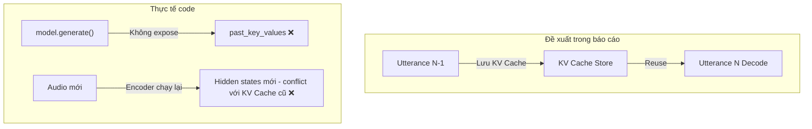

# Phân Tích Chuyên Sâu: Cơ Chế Đánh Giá RTF và Khả Năng Áp Dụng Realtime "Commit theo Utterance" của Voxtral ASR

> [!NOTE]
> Báo cáo này đối chiếu trực tiếp giữa thiết kế đề xuất về hiệu năng (RTF) và cơ chế "Commit theo Utterance" với mã nguồn thực tế của hệ thống Voxtral ASR (`voxtral_server_transformers.py` và `run_asr.py`). Phân tích này chỉ ra các lỗ hổng kỹ thuật, đề xuất các phương án khắc phục khả thi, và cập nhật lộ trình kiểm soát đầu ra (Acceptance Gates) để hướng tới kịch bản đàm thoại thời gian thực.

---

## 1. Phân Tích Cơ Chế Đánh Giá RTF Hiện Tại

Cơ chế đo lường **Real-Time Factor (RTF)** hiện được định nghĩa và triển khai qua các tham số trong `run_asr.py` và `benchmark_runner.py`.

### 1.1. Cách tính toán Metric
*   **Total Time ($T_{total}$)**: Thời gian từ lúc client chuẩn bị kết nối và load audio cho đến khi nhận được kết quả cuối cùng (`response.audio_transcript.done`).
*   **Wait Time / Wait After Commit ($T_{wait}$)**: Thời gian từ khi gửi gói tin `input_audio_buffer.commit` cho đến khi nhận được kết quả cuối cùng.
*   **Audio Duration ($D$)**: Độ dài của file âm thanh.
*   **Total RTF**:
    $$RTF_{total} = \frac{T_{total}}{D}$$
*   **Inference RTF**:
    $$RTF_{inference} = \frac{T_{wait}}{D}$$

### 1.2. Đánh giá ưu điểm
*   **Đo lường Throughput chính xác**: Khi chạy ở chế độ **Throughput Mode** (`--chunk-interval 0`), client gửi toàn bộ dữ liệu âm thanh ngay lập tức. Lúc này, $T_{wait}$ phản ánh chính xác thời gian xử lý thực tế của GPU cho toàn bộ file âm thanh.
*   **Tích hợp đầy đủ pipeline**: RTF đo lường toàn bộ thời gian của các bước tiền xử lý (preprocessing), Silero VAD, suy luận mô hình (inference), và các cơ chế khôi phục lỗi (retry/sub-chunking).

### 1.3. Các điểm hạn chế & Lỗi thiết kế của cơ chế đánh giá
1.  **Chế độ mô phỏng Realtime (`--chunk-interval 0.1`) bị sai lệch ý nghĩa**:
    *   Client gửi các chunk 100ms cách nhau 100ms để mô phỏng việc người dùng đang nói. Việc này khiến thời gian stream kéo dài đúng bằng thời lượng file âm thanh ($T_{stream} \approx D$).
    *   Tuy nhiên, server **không thực hiện suy luận** trong lúc stream mà chỉ tích lũy vào `audio_buffer`.
    *   Do đó, $T_{total} \approx D + T_{wait}$.
    *   Công thức tính $RTF_{total} = \frac{D + T_{wait}}{D} = 1 + RTF_{inference}$.
    *   Chỉ số $RTF_{total}$ trong trường hợp này luôn lớn hơn 1 và bị cộng thêm thời gian chờ nhân tạo từ phía client, khiến nó không phản ánh đúng hiệu năng thực tế của phần cứng.
2.  **Thiếu phép đo Telemetry chi tiết cho Streaming Deltas**:
    *   Client có nhận gói tin `response.audio_transcript.delta` (tại `run_asr.py:201`), nhưng công cụ benchmark hoàn toàn không đo lường các mốc thời gian/TTFT (Time-to-First-Token) hay độ trễ của từng token.
    *   Quan trọng hơn, server chỉ kích hoạt `on_delta` khi luồng xử lý chỉ có duy nhất 1 chunk (`i == 0 and len(chunks) == 1` tại `voxtral_server_transformers.py:1128`). Với các file âm thanh dài cần chia nhiều chunk, server hoàn toàn tắt delta streaming (`current_on_delta = None`), nghĩa là không có dữ liệu văn bản nào được stream về client trong lúc suy luận.
3.  **Che giấu độ trễ đỉnh (Latency Jitter) do các cơ chế sửa lỗi**:
    *   Các cơ chế sửa lỗi như *sub-chunking*, *hallucination retry* và *language collapse recovery* hoạt động tuần tự và tốn rất nhiều tài nguyên.
    *   Khi một chunk bị lỗi và kích hoạt retry, RTF của chunk đó sẽ vọt lên rất cao. Việc chỉ tính RTF trung bình trên toàn bộ batch chạy làm mờ đi các điểm nghẽn cục bộ (spikes), vốn là tác nhân trực tiếp gây gián đoạn trải nghiệm người dùng trong thực tế.

---

## 2. Phân Tích Thực Tế: Hệ Thống Đã Áp Dụng Realtime Được Chưa?

**Kết luận: Hệ thống hiện tại CHƯA THỂ áp dụng vào các ứng dụng realtime thực tế.**

Dưới đây là các nguyên nhân kỹ thuật cốt lõi:

### 2.1. Bản chất Server vẫn là Batch-processing (không phải Streaming ASR)
*   Thiết kế server hiện tại tích lũy toàn bộ luồng âm thanh vào bộ đệm và chỉ thực hiện suy luận sau khi nhận lệnh `commit`.
*   **Hậu quả**: Thời gian người dùng phải chờ để nhận được phản hồi tỷ lệ thuận với độ dài cuộc nói chuyện. Nếu cuộc đối thoại kéo dài 1-2 phút (ví dụ: cuộc gọi điện thoại tổng đài), người dùng sẽ phải im lặng chờ từ 1 đến 1.5 phút sau khi kết thúc câu thoại mới nhận được văn bản đầy đủ.

### 2.2. Tốc độ xử lý của GPU chậm hơn tốc độ nói ($RTF_{inference} > 1.0$)
*   Dựa trên kết quả chạy thử nghiệm thực tế gần nhất, với file âm thanh dài 80.08 giây (`media_148280_1767762915627.mp3`):
    *   Thời gian chờ phản hồi thực tế ($T_{wait}$) là **131.60 giây** (Inference RTF = 1.643).
    *   Tổng thời gian xử lý là **132.83 giây** (Total RTF = 1.659).
*   Trong hệ thống realtime, tốc độ giải mã bắt buộc phải nhanh hơn tốc độ nói ($RTF_{inference} < 1.0$). Với RTF đàm thoại thực tế đạt ~1.64, hàng đợi xử lý âm thanh sẽ tích lũy ngày càng dài, gây ra hiện tượng lag lũy tiến vô hạn.

**Tại sao tốc độ suy luận lại chậm?**
1.  **Kích thước mô hình lớn (4B parameters)**: Mô hình `Voxtral-Mini-4B` khá nặng đối với các GPU tầm trung như Tesla T4 trên Colab, đặc biệt khi chạy suy luận tự hồi quy sinh mã (autoregressive generation).
2.  **Xử lý Chunk tuần tự (Sequential Execution Bottleneck)**:
    Mã nguồn tại `voxtral_server_transformers.py:1126` thực hiện vòng lặp `for` tuần tự qua từng chunk âm thanh. Vì pipeline không thực hiện batching hoặc suy luận song song (parallelize chunks), độ trễ của từng chunk bị cộng dồn tuyến tính. Điều này làm hạn chế khả năng khai thác tối đa năng lực xử lý song song của GPU.
3.  **Chi phí Dynamic Dequantization**:
    Chế độ 4-bit giúp tiết kiệm VRAM để mô hình vừa với GPU, nhưng trên các cấu trúc GPU cũ, việc dequantization động các tham số trong lúc nhân ma trận có thể tạo ra bottleneck làm chậm tốc độ sinh token so với chạy FP16/BF16 thuần túy.

### 2.3. Latency không ổn định (High Jitter) do các lớp Guardrails
*   Các lớp sửa lỗi (Sub-chunking, Language Collapse, Hallucination) hoạt động như các vòng lặp retry tuần tự. Khi tín hiệu âm thanh có nhiễu hoặc lỗi ngôn ngữ, độ trễ suy luận sẽ bị nhân đôi hoặc nhân ba ngẫu nhiên, không đảm bảo được cam kết dịch vụ (SLA) về thời gian phản hồi.

---

## 3. Đánh Giá Cơ Chế Đề Xuất "Commit Theo Utterance"

Đề xuất chia nhỏ audio theo boundary tự nhiên (speech pause) thay vì streaming sliding-window là một cách tiếp cận **hợp lý và thực tế** cho kiến trúc hiện tại:
*   **Tương thích kiến trúc**: Server hiện tại đã là *batch-on-commit*. Việc commit theo utterance chỉ thay đổi tần suất commit từ client mà không yêu cầu viết lại hoàn toàn protocol hoặc inference engine (điều đòi hỏi viết lại 10x code do Voxtral không hỗ trợ CTC/RNN-T streaming).
*   **Kích hoạt Delta Streaming**: Với utterance ngắn $\le 5$ giây, server chỉ tạo ra đúng 1 chunk âm thanh. Nhờ đó, điều kiện dòng [1128](file:///d:/VJ/Voxtral/voxtral_server_transformers.py#L1128) (`i == 0 and len(chunks) == 1`) được thỏa mãn, kích hoạt luồng stream delta về cho client để người dùng nhìn thấy text xuất hiện dần.

---

## 4. Các Lỗ Hổng Thiết Kế Nghiêm Trọng & Đánh Giá Tính Khả Thi

Mặc dù ý tưởng commit theo utterance đi đúng hướng, bản thiết kế chi tiết chứa **5 lỗ hổng nghiêm trọng** khiến việc triển khai trực tiếp là **chưa khả thi** nếu không được điều chỉnh:

### 4.1. Đánh giá tính khả thi tổng quan (Overall Verdict)

| Hạng mục | Verdict | Mức độ sửa |
|:---|:---|:---|
| Ý tưởng commit theo utterance | ✅ **PASS** | Giữ nguyên ý tưởng cốt lõi |
| KV Cache Carry-Over | ❌ **REJECT** | Loại bỏ hoàn toàn khỏi thiết kế |
| Contextual Text History | ⚠️ **NEEDS VALIDATION** | Cần verify model capability và API thực tế |
| Client VAD implementation | ⚠️ **INCOMPLETE** | Cần thiết kế chi tiết (thêm WebRTC VAD) |
| Latency gate thresholds | ❌ **INCONSISTENT** | Điều chỉnh các gate latency phù hợp với RTF |
| Multi-commit protocol | ⚠️ **UNDESIGNED** | Thiết kế per-connection FIFO queue thay vì song song |
| Audio Context Prepending | ⚠️ **HIGH RISK** | Chuyển thành thí nghiệm A/B Testing, không bật mặc định |

### 4.2. KV Cache Carry-Over: Hoàn toàn không khả thi (Infeasible)
Thiết kế đề xuất lưu trữ `past_key_values` của decoder tương ứng với `conn_id` để tái sử dụng cho utterance tiếp theo. Tuy nhiên, phân tích mã nguồn chỉ ra:
1.  **Hạn chế của API model.generate()**: Hàm `_run_inference_for_chunk` (dòng [539-621](file:///d:/VJ/Voxtral/voxtral_server_transformers.py#L539-L621)) sử dụng API high-level `model.generate()`. API này không trả về KV Cache sau khi sinh xong token. Muốn lấy được KV Cache, bắt buộc phải tự viết lại vòng lặp autoregressive thủ công bằng `model.forward()`, tăng độ phức tạp của code lên rất nhiều.
2.  **Xung đột biểu diễn Audio Encoder**: Voxtral là mô hình đa phương thức (multimodal encoder-decoder). KV Cache chứa cả các hidden states từ audio encoder lẫn text decoder. Khi utterance tiếp theo gửi tới với dữ liệu audio mới, encoder bắt buộc phải chạy lại trên audio mới này. Do đó, KV Cache cũ của phần audio encoder sẽ bị stale (lỗi thời) và không thể "ghép nối" trực tiếp với output mới của encoder.
3.  **Áp lực VRAM (OOM)**: Mỗi lượt generate của Voxtral 4B (4-bit) đã chiếm từ 12-14GB VRAM trên GPU T4 (16GB). Việc duy trì KV Cache (kích thước lớn do chứa cả thông tin âm thanh và văn bản) cho hàng chục session đồng thời sẽ dẫn tới lỗi tràn bộ nhớ VRAM (Out-Of-Memory) ngay lập tức.
4.  **Thiếu cơ chế giải phóng (Eviction)**: Thiết kế không đề cập tới thời gian tồn tại (TTL) hay chính sách thu hồi cache (eviction policy) khi người dùng dừng nói.

> [!CAUTION]
> **Kết luận**: KV Cache Carry-Over là **không khả thi** nếu không thay đổi hoàn toàn kiến trúc suy luận của mô hình. Cần loại bỏ đề xuất này và thay thế bằng một cơ chế thực tế hơn.

### 4.3. Contextual Text History: Khả thi nhưng thiếu chi tiết kỹ thuật
Thiết kế đề xuất truyền lịch sử text của 1-2 utterance trước vào prompt qua `apply_chat_template`. Các điểm bất hợp lý trong thực tế:
1.  **Không tồn tại trong codebase**: Giao thức chat template hoàn toàn chưa được xây dựng. Processor hiện tại chỉ xử lý audio (`processor(audio=...)` tại dòng [561](file:///d:/VJ/Voxtral/voxtral_server_transformers.py#L561)).
2.  **Mô hình không hỗ trợ**: Comment trong mã nguồn tại dòng [556-557](file:///d:/VJ/Voxtral/voxtral_server_transformers.py#L556-L557) nêu rõ: *"Voxtral model does NOT support language hints via text prefix"*. Do đó, việc inject text prompt lịch sử có thể không được mô hình hỗ trợ hoặc không đem lại hiệu quả cải thiện CER.
3.  **Reset trạng thái per Session**: Server xóa sạch bộ đệm âm thanh và trạng thái nhận diện ngay sau khi commit gửi xong (dòng [1662-1665](file:///d:/VJ/Voxtral/voxtral_server_transformers.py#L1662-L1665)): `audio_buffer = bytearray()`, `speech_detected = False`. Hiện tại không có vùng lưu trữ transcript lịch sử per session.

### 4.4. Client-side VAD cho Utterance Detection: Chưa được thiết kế chi tiết
1.  **Client hiện tại không có VAD**: Client (`run_asr.py` dòng [148-173](file:///d:/VJ/Voxtral/run_asr.py#L148-L173)) gửi liên tục các chunk 100ms cố định và chỉ commit một lần duy nhất ở cuối file. Không hề có logic phân đoạn theo VAD.
2.  **Khoảng lặng 1.0–1.5s là quá dài**: Đối với hội thoại Nhật Bản, natural pause thường chỉ kéo dài 300-600ms. Đợi 1.5s mới commit sẽ làm tăng độ trễ turn-taking đáng kể. Ngược lại, nếu đặt quá ngắn sẽ gây hiện tượng over-segmentation (chia nhỏ câu quá mức) khiến mô hình mất ngữ cảnh và dịch sai.
3.  **Lỗi tranh chấp luồng (Race Conditions)**: Nếu client gửi commit thứ hai khi server đang bận suy luận cho commit thứ nhất, việc thiếu hàng đợi (inference queue) trên server sẽ dẫn đến tranh chấp tài nguyên trên `audio_buffer` và gây crash hệ thống do chạy bất tuần tự.
4.  **Cơ chế Hủy bỏ (Cancellation) khó khả thi**: Vì `model.generate()` chạy trên một luồng phụ (thread) bất đồng bộ của server, việc cố gắng hủy bỏ (cancel) tác vụ GPU đang chạy từ bản tin WebSocket rất khó thực hiện sạch sẽ mà không gây bất ổn định luồng xử lý hoặc rò rỉ bộ nhớ GPU. Do đó, cơ chế hủy bỏ cần được hạ độ ưu tiên.

### 4.5. Mâu Thuẫn Giữa RTF Target và Latency Gate
Báo cáo đề xuất mục tiêu Stage 2 đạt **RTF < 0.8** và Latency Gate cho utterance 5s là **< 1.0s**. 
*   Về mặt toán học: Một utterance 5s chạy với RTF = 0.8 sẽ mất ít nhất $5 \times 0.8 = 4.0s$ thời gian suy luận trên server. 
*   Do đó, gate latency < 1.0s là **hoàn toàn mâu thuẫn** với RTF target 0.8. Để đạt latency < 1.0s cho utterance 5s, RTF bắt buộc phải nhỏ hơn 0.2 (điều chỉ có thể đạt được ở Stage 3 khi tối ưu hóa engine sâu).

---

## 5. Lộ Trình Cải Tiến Cập Nhật & Thiết Kế Kỹ Thuật Chi Tiết

Để khắc phục các lỗ hổng trên, lộ trình cải tiến được điều chỉnh chi tiết như sau:

### 5.1. Stage 1: Chuẩn Hóa Đo Lường & Telemetry (Telemetry Accuracy Gate)
Mục tiêu giai đoạn này là xây dựng bộ đo lường chi tiết để chẩn đoán chính xác hiệu năng mà không thực hiện các thay đổi kiến trúc lớn. Triển khai các mốc đo lường (telemetry hooks) chi tiết trong `_run_inference_for_chunk` (tại dòng [561](file:///d:/VJ/Voxtral/voxtral_server_transformers.py#L561)) để tách biệt các mốc thời gian:
1.  **Preprocessing Time**: Thời gian convert từ audio numpy array sang input tensor.
2.  **Audio Encoder Time**: Thời gian forward qua audio encoder.
3.  **Decoder Generation Time**:
    *   *TTFT (Time-to-First-Token)*: Thời gian từ lúc bắt đầu generate đến khi streamer nhận token đầu tiên.
    *   *Average Decoding Latency per Token*: Thời gian sinh trung bình per token (ms/token).
    *   *Total Tokens*: Số token giải mã thực tế.
4.  **Pipeline Overhead**: Đo lường thời gian trễ của hàng đợi kết nối (queue wait time), thời gian chạy VAD trim và thời gian phục hồi lỗi (retry elapsed).

### 5.2. Stage 2: Triển Khai Cơ Chế Utterance Commit Tối Thiểu (Basic Utterance Commit)
Implement giải pháp commit theo utterance đơn giản, tập trung vào độ ổn định của giao thức đàm thoại, không bật các cơ chế giữ ngữ cảnh mặc định:
1.  **Client-Side VAD Stack**:
    *   Tích hợp thư viện `py-webrtcvad` trên client (nhẹ, không cần PyTorch).
    *   **Tham số cấu hình**:
        *   *Silence Threshold*: `800ms` (phù hợp khoảng nghỉ đàm thoại tiếng Nhật).
        *   *Max Utterance Length*: `10s` (buộc phải commit nếu người nói liên tục không nghỉ để tránh tràn bộ đệm).
        *   *Min Utterance Length*: `500ms` (tránh trigger commit do nhiễu ngắn).
2.  **Giao thức Multi-Commit trên Server**:
    *   **Inference Queue per Session**: Server duy trì một FIFO queue xử lý logic tuần tự cho từng `conn_id`. Nếu commit tiếp theo đến khi commit trước đang suy luận, server xếp hàng chờ thay vì xử lý song song để tránh race condition trên GPU và `audio_buffer`.
    *   **Sequence Numbering (`commit_id`)**: Gắn ID tuần tự vào mỗi gói commit gửi từ client và response trả về từ server để client có thể khớp kết quả chính xác, đồng thời áp dụng cơ chế "drop stale response" (bỏ qua kết quả cũ nếu nhận được kết quả của commit_id mới hơn).
    *   **Loại bỏ KV-Cache & Giữ ngữ cảnh mặc định**: Giai đoạn này **tắt hoàn toàn** KV-Cache carry-over và chưa sử dụng Audio Context Prepending để đảm bảo latency tối thiểu và hệ thống chạy ổn định trước.

### 5.3. Stage 3: Thử Nghiệm Tối Ưu Hóa & Duy Trì Ngữ Cảnh (Context Experiments & Fast Inference)
1.  **Thử nghiệm Audio Context Prepending (Feature Flag Controlled)**:
    *   *Rủi ro*: Việc prepend 2-3s audio của câu trước làm tăng độ dài đầu vào mô hình, tăng latency suy luận, dễ sinh duplicate text và thuật toán fuzzy overlap loại bỏ trùng lặp có thể hoạt động kém chính xác trên ngôn ngữ tiếng Nhật.
    *   *Phương án*: Triển khai Audio Context Prepending dưới dạng **Feature Flag ẩn** và tiến hành các bài test A/B Testing. Chỉ giữ lại tính năng này nếu chứng minh được nó giảm CER một cách đáng kể mà không làm RTF hoặc hiện tượng trùng lặp text tệ đi.
2.  **Tối ưu hóa Engine & Song song hóa Chunks**:
    *   Tích hợp TensorRT-LLM, vLLM hoặc ONNX Runtime cho Voxtral, đặc biệt tối ưu hóa audio encoder.
    *   Chuyển đổi sang quantization FP8/AWQ tĩnh để loại bỏ bottleneck dequantization động trên GPU.

---

## 6. Cổng Kiểm Soát Đầu Ruột & Bản So Sánh Chỉ Tiêu Target (Acceptance Gates)

Dưới đây là các cổng kiểm soát được điều chỉnh lại để đảm bảo tính nhất quán về mặt toán học và kỹ thuật:

### 6.1. Cổng Kiểm Soát Thống Kê Định Lượng (Quantitative Acceptance Gates)

| Giai đoạn | Tên Cổng Kiểm Soát (Gate) | Tiêu chí Đo lường (Metric) | Ngưỡng Đạt (Pass Threshold) | Trạng thái Hiện tại |
| :--- | :--- | :--- | :--- | :--- |
| **Stage 1** | **Telemetry Accuracy Gate** | Tỷ lệ phủ của telemetry đo lường | **100%** chunk được phân rã số liệu | Chưa có (gộp chung) |
| | | Overhead của việc đo lường | **< 5%** tổng thời gian suy luận | Chưa đo lường |
| **Stage 2** | **Utterance Near-Realtime Gate** | Độ trễ chờ của câu ngắn ($T_{wait}$) | **< 4.0s** (cho utterance $\le 5s$) **< 2.0s** (cho utterance $\le 2.5s$) | `~7.8s` - `8.2s` (Ước lượng từ RTF speech hiện tại) |
| | | Inference RTF của chunk ($RTF_{inference}$) | **< 0.8** (Đo trên từng utterance ngắn lẻ) | `~1.554` (Thất bại) |
| | | Độ chính xác nhận dạng (Speech-only CER) | **< 35%** (Không dùng Audio Context mặc định) | `36.01%` (Thất bại) |
| **Stage 3** | **Production Concurrency Gate** | Inference RTF trung bình hệ thống ($RTF_{inference}$) | **< 0.4** (Có batching và tăng tốc suy luận) | Chưa thực hiện |
| | | Jitter trễ đỉnh của chunk (p95 Latency) | **< 4.0 giây** (cho chunk $\le 5s$, tương đương p95 RTF < 0.8) | `~12.3s` (Thất bại - p95 RTF ~2.47) |
| | | Độ chính xác nhận dạng dưới tải (CER) | **< 30%** (Nếu bật Context thành công) | `36.01%` (Thất bại) |

### 6.2. Bản So Sánh Baseline và Chỉ Tiêu Target Theo Từng Stage (Target Benchmarking)

Số liệu Baseline được cập nhật chính xác từ kết quả thực tế trên các file có tiếng nói (speech files), loại trừ các file nhiễu/yên lặng:

| Chỉ số (Metric) | Baseline Hiện Tại | Target Stage 1 (Telemetry) | Target Stage 2 (Utterance) | Target Stage 3 (Engine Optimization) |
| :--- | :--- | :--- | :--- | :--- |
| **Inference RTF (Speech)** | **~1.554** (Chỉ tính speech files) | $\le 1.60$ (Chấp nhận overhead nhỏ) | **< 0.8** (Đo trên utterance lẻ) | **< 0.4** (Đo trên toàn hệ thống) |
| **Speech-only CER** | **36.01%** | $\le 36.01\%$ (Giữ nguyên chất lượng) | **< 35.0%** (Không bật context mặc định) | **< 30.0%** (Thử nghiệm context thành công) |
| **Độ trễ chờ thực tế ($T_{wait}$)** | **~131.6s** (Đo trên file 80s)  *Ước lượng cho utterance 5s là ~7.8s - 8.2s, p95 là ~12.3s* | Không đổi | **< 4.0s** (cho utterance $\le 5s$) **< 2.0s** (cho utterance $\le 2.5s$) | **< 0.5 giây** (cho utterance $\le 5s$) |
| **p95 Chunk RTF (Jitter)** | **2.47** (Tương đương trễ ~12.3s trên chunk 5s) | Không đổi | **< 1.5** (Trễ ~7.5s trên chunk 5s) | **< 0.8** (Trễ ~4.0s trên chunk 5s) |
| **Trạng thái Đánh giá (Verdict)** | **REJECTED** | **REJECTED** (Chỉ ghi nhận thông số) | **ACCEPTED** (Thực tế sử dụng) | **EXCELLENT** (Sản xuất quy mô lớn) |
