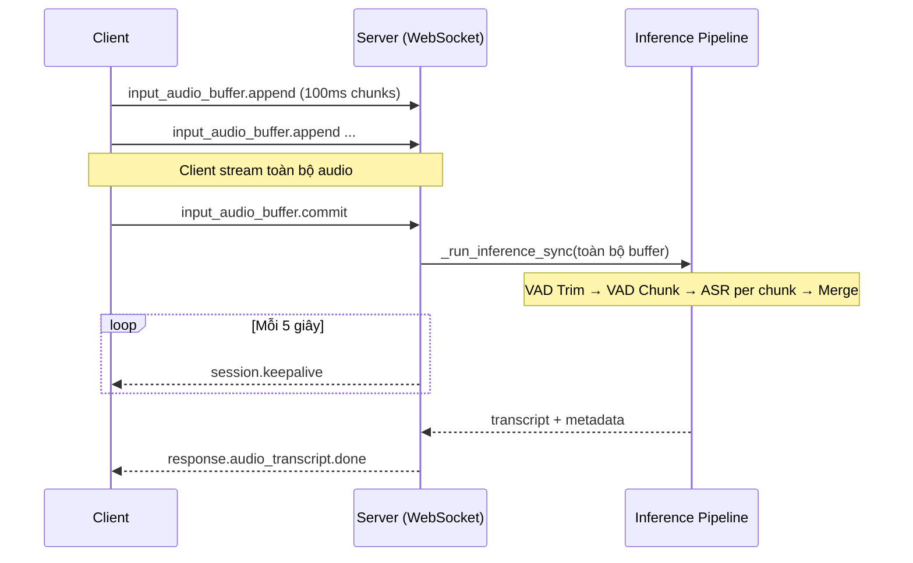
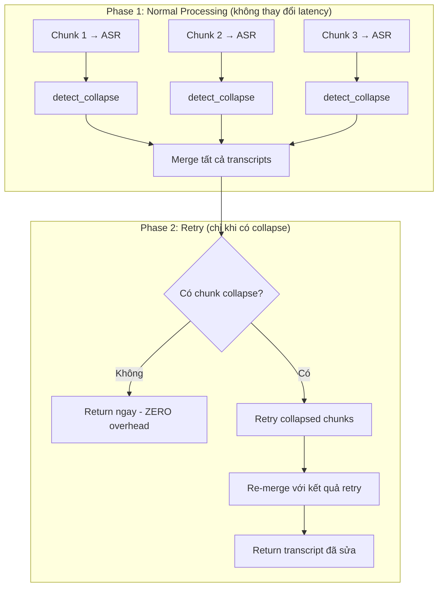

# Language Collapse Auto-Recovery (Per-Chunk Language Detection + Retry)

## Bối cảnh vấn đề

Khi Voxtral ASR xử lý audio tiếng Nhật theo chunks, model auto-detect ngôn ngữ **độc lập cho từng chunk**. Nếu một chunk khó nghe (nhiễu, nói nhỏ, âm lượng thấp), model có thể nhận nhầm sang tiếng Anh → output ra gibberish/hallucination tiếng Anh.

**Cơ chế hiện tại** (`_check_hallucination_guardrails`) chỉ LOG cảnh báo ở cuối pipeline, sau khi đã merge tất cả chunks. Nó **không sửa** được từng chunk bị lỗi.

## Phân tích kiến trúc realtime hiện tại

### Mô hình giao tiếp: "Batch-at-Commit"



> [!IMPORTANT]
> **Phát hiện quan trọng**: Hệ thống hiện tại **KHÔNG phải streaming ASR thực sự**. Client gửi toàn bộ audio → commit → server xử lý hết → trả kết quả. Tức là đây là mô hình **"Batch-at-Commit"**, không phải real-time per-chunk streaming.

Điều này có nghĩa:
1. ✅ **Tất cả chunks đều có sẵn** tại thời điểm xử lý → không cần "đợi chunk sau" như lo ngại ban đầu
2. ⚠️ **Latency concern**: Retry sẽ thêm thời gian chờ vào giai đoạn commit → client đợi lâu hơn

### Phân tích Latency Impact (CỰC KỲ QUAN TRỌNG)

Dựa trên benchmark data:
- **Avg Inference RTF**: ~1.9 (tức 15s audio cần ~28.5s để xử lý)
- **Chunks per file**: Thường 2-4 chunks cho audio 20-60s
- **Chunks are processed SEQUENTIALLY** (line 634: vòng `for i, chunk_info in enumerate(chunks)`)

**Ước tính latency cho các scenario:**

| Scenario | Chunks | Retries | Thời gian xử lý ước tính | Tăng % |
| :--- | :---: | :---: | :--- | :---: |
| Audio 30s, 0 collapse | 2 | 0 | 30s × 1.9 = **57s** | 0% |
| Audio 30s, 1 collapse | 2 | 1 retry (30s merged) | 57s + 30×1.9 = **114s** | **+100%** ⚠️ |
| Audio 60s, 1 collapse | 4 | 1 retry (30s merged) | 114s + 57s = **171s** | **+50%** |
| Audio 60s, 2 collapse liên tiếp | 4 | 1 retry (45s merged) | 114s + 85s = **199s** | **+75%** |

> [!CAUTION]
> **Vấn đề nghiêm trọng**: Retry ghép 2 chunk (30s audio) với RTF 1.9 sẽ mất thêm **~57 giây**. Đây là unacceptable cho nhiều use case (call center live, v.v.).
>
> Plan ban đầu chưa đề cập giải pháp tối ưu latency.

## Giải pháp tối ưu đề xuất

### Strategy A: Parallel Detection + Deferred Retry (ĐỀ XUẤT CHÍNH)

Thay vì retry ngay, ta **tách việc detect và retry** thành 2 phase:



**Ưu điểm:**
- **Happy path (90%+ requests): ZERO latency overhead** — chỉ thêm 1 lần gọi `_detect_language_collapse()` (string check, <1ms)
- Unhappy path: vẫn phải retry nhưng đây là tradeoff chấp nhận được (sai → chậm hơn nhưng đúng, vs sai → nhanh nhưng sai)

### Strategy B: Lightweight Retry (Giảm latency retry)

Thay vì retry inference trên toàn bộ merged audio (2 chunks = 30s), ta có thể:

1. **Chỉ retry chunk bị lỗi** (15s) thay vì merged chunk (30s) — nhưng cần cách "hint" ngôn ngữ
2. Voxtral **KHÔNG hỗ trợ language hint** qua text prefix (line 299-300 trong code)
3. **Giải pháp**: Prepend một đoạn audio ngắn (~2-3s) từ chunk lân cận healthy thay vì merge toàn bộ

```python
# Thay vì merge toàn bộ 2 chunk (30s):
merged = np.concatenate([chunk_prev_audio, chunk_bad_audio])  # 30s → RTF 1.9 → 57s

# Chỉ prepend context ngắn (3s) + chunk bị lỗi (15s) = 18s:
context_samples = int(3.0 * 16000)  # 3 giây context
context_audio = chunk_prev_audio[-context_samples:]  # Lấy 3s cuối chunk trước
retry_audio = np.concatenate([context_audio, chunk_bad_audio])  # 18s → RTF 1.9 → 34s
```

**So sánh latency retry:**

| Approach | Retry audio length | Retry time (RTF 1.9) | So với merge toàn bộ |
| :--- | :---: | :---: | :---: |
| Merge toàn bộ 2 chunk | 30s | ~57s | Baseline |
| **Context prefix 3s + chunk** | 18s | ~34s | **-40%** |
| Context prefix 5s + chunk | 20s | ~38s | -33% |

> [!TIP]
> **Strategy B giảm latency retry từ ~57s xuống ~34s** mà vẫn cung cấp đủ context tiếng Nhật cho model "neo" ngôn ngữ. 3 giây context (~36 ký tự tiếng Nhật) là đủ cho model nhận diện ngôn ngữ.

### Strategy C: Post-processing Fallback (Bổ sung)

Nếu retry vẫn thất bại (model vẫn output English), sử dụng rule-based để xử lý:
- Loại bỏ các câu tiếng Anh rõ ràng là hallucination (ví dụ: "Hi, Joseph. How are you?")
- Giữ nguyên tên riêng tiếng Anh trong context tiếng Nhật

## Thiết kế chi tiết (Kết hợp Strategy A + B)

### Vị trí can thiệp trong code

Toàn bộ thay đổi nằm trong hàm `run_inference_with_config()` (line 589-651), block `else` xử lý multi-chunk (line 628-651).

### Luồng xử lý mới

```python
# PSEUDO-CODE - Luồng trong run_inference_with_config()

# ===== Phase 1: Normal inference (giữ nguyên) =====
transcripts = []
chunk_infos = []
for i, chunk_info in enumerate(chunks):
    transcript, elapsed = _run_inference_for_chunk(chunk_info['audio_np'], ...)
    transcripts.append((transcript, duration))
    chunk_infos.append(chunk_info)

# ===== Phase 2: Language Collapse Detection =====
if not ENABLE_LANG_COLLAPSE_RECOVERY:
    # Feature flag OFF → skip
    return _merge_chunk_transcripts(transcripts, chunk_infos), elapsed

collapsed_indices = []
for i, (text, dur) in enumerate(transcripts):
    detection = _detect_language_collapse(text)
    if detection["is_collapsed"]:
        collapsed_indices.append(i)
        _slog(conn_id, f"[LangCollapse] Chunk {i} ({dur:.1f}s): {detection}")

if not collapsed_indices:
    # Happy path → no retry needed
    return _merge_chunk_transcripts(transcripts, chunk_infos), elapsed

# ===== Phase 3: Retry with Context Prefix =====
lang_retries = []
groups = _group_consecutive(collapsed_indices)

for group in groups:
    anchor_idx = _find_healthy_neighbor(group, len(chunks), collapsed_indices)
    if anchor_idx is None:
        _slog(conn_id, f"[LangCollapse] No healthy anchor for group {group}, skipping retry")
        continue
    
    # Build retry audio: context prefix (3s) + collapsed chunk(s)
    CONTEXT_PREFIX_SEC = 3.0
    context_samples = int(CONTEXT_PREFIX_SEC * 16000)
    anchor_audio = chunks[anchor_idx]['audio_np']
    
    if anchor_idx < group[0]:
        # Anchor is BEFORE collapsed group → take last 3s of anchor
        context = anchor_audio[-context_samples:] if len(anchor_audio) > context_samples else anchor_audio
    else:
        # Anchor is AFTER collapsed group → take first 3s of anchor
        context = anchor_audio[:context_samples] if len(anchor_audio) > context_samples else anchor_audio
    
    # Concatenate collapsed chunks
    collapsed_audio = np.concatenate([chunks[i]['audio_np'] for i in group])
    
    # Build retry audio
    if anchor_idx < group[0]:
        retry_audio = np.concatenate([context, collapsed_audio])
    else:
        retry_audio = np.concatenate([collapsed_audio, context])
    
    # Run retry inference
    retry_transcript, retry_elapsed = _run_inference_for_chunk(retry_audio, session_config, conn_id)
    retry_detection = _detect_language_collapse(retry_transcript)
    
    if not retry_detection["is_collapsed"]:
        # Retry succeeded! Extract only the collapsed portion's transcript
        # (Remove the context prefix contribution)
        # Strategy: Use the retry transcript for the collapsed chunks
        # and trim the anchor's contribution by overlap detection
        
        if anchor_idx < group[0]:
            # Context was at the beginning → trim anchor's text from start
            anchor_text = transcripts[anchor_idx][0]
            overlap = _exact_overlap_chars(anchor_text, retry_transcript)
            corrected_text = retry_transcript[overlap:] if overlap else retry_transcript
        else:
            # Context was at the end → trim anchor's text from end
            anchor_text = transcripts[anchor_idx][0]
            overlap = _exact_overlap_chars(retry_transcript, anchor_text)
            corrected_text = retry_transcript[:len(retry_transcript)-overlap] if overlap else retry_transcript
        
        # Replace collapsed chunks' transcripts
        for j, idx in enumerate(group):
            if j == 0:
                transcripts[idx] = (corrected_text, transcripts[idx][1])
            else:
                transcripts[idx] = ("", transcripts[idx][1])
        
        lang_retries.append({"group": group, "anchor": anchor_idx, "status": "fixed"})
        _slog(conn_id, f"[LangCollapse] Group {group} fixed via anchor chunk {anchor_idx}")
    else:
        # Retry still failed → keep original, log for investigation
        lang_retries.append({"group": group, "anchor": anchor_idx, "status": "failed"})
        _slog(conn_id, f"[LangCollapse] Group {group} retry FAILED, keeping original")

# Merge all transcripts (including fixed ones)
transcript = _merge_chunk_transcripts(transcripts, chunk_infos)
```

### Các hàm mới cần thêm

#### `_detect_language_collapse(transcript: str) -> dict`

```python
LANG_COLLAPSE_ASCII_RATIO = 0.6
LANG_COLLAPSE_MIN_CHARS = 5

def _detect_language_collapse(transcript: str) -> dict:
    text = transcript.strip()
    if len(text) < LANG_COLLAPSE_MIN_CHARS:
        return {"is_collapsed": False, "ascii_ratio": 0.0, "reason": "too_short"}
    
    non_ws = [c for c in text if not c.isspace()]
    if not non_ws:
        return {"is_collapsed": False, "ascii_ratio": 0.0, "reason": "empty"}
    
    ascii_alpha = sum(1 for c in non_ws if c.isascii() and c.isalpha())
    ratio = ascii_alpha / len(non_ws)
    
    return {
        "is_collapsed": ratio > LANG_COLLAPSE_ASCII_RATIO,
        "ascii_ratio": round(ratio, 3),
        "reason": f"ascii_ratio={ratio:.1%}" if ratio > LANG_COLLAPSE_ASCII_RATIO else "ok",
    }
```

#### `_group_consecutive(indices) -> list[list[int]]`

```python
def _group_consecutive(indices: list[int]) -> list[list[int]]:
    if not indices:
        return []
    groups = [[indices[0]]]
    for idx in indices[1:]:
        if idx == groups[-1][-1] + 1:
            groups[-1].append(idx)
        else:
            groups.append([idx])
    return groups
```

#### `_find_healthy_neighbor(group, total, collapsed) -> int | None`

```python
def _find_healthy_neighbor(group: list[int], total_chunks: int, 
                           collapsed: list[int]) -> int | None:
    # Try neighbor BEFORE the group first (better context)
    before = group[0] - 1
    if before >= 0 and before not in collapsed:
        return before
    # Try neighbor AFTER the group
    after = group[-1] + 1
    if after < total_chunks and after not in collapsed:
        return after
    return None
```

### Constants & Config

```python
# Language Collapse Auto-Recovery config
LANG_COLLAPSE_ASCII_RATIO = 0.7       # >70% ASCII alpha = collapsed (User requested 70%)
LANG_COLLAPSE_MIN_CHARS = 5           # Min length to check
LANG_COLLAPSE_CONTEXT_SEC = 5.0       # Seconds of context to prepend from anchor (User requested 5s)
LANG_COLLAPSE_MAX_RETRY_CHUNKS = 3    # Max collapsed chunks to merge for retry
ENABLE_LANG_COLLAPSE_RECOVERY = True  # Feature flag
```

### Observability

Thêm vào `_vad_config_metadata()`:
```python
"LANG_COLLAPSE_ASCII_RATIO": LANG_COLLAPSE_ASCII_RATIO,
"LANG_COLLAPSE_RECOVERY": ENABLE_LANG_COLLAPSE_RECOVERY,
```

Thêm `lang_collapse_retries` vào response payload để evaluator tracking.

## Edge Case Analysis (Bổ sung cho Realtime)

| Edge Case | Impact | Xử lý |
| :--- | :--- | :--- |
| **Single chunk audio** (< 15s) | Không qua multi-chunk → không áp dụng được | OK — file ngắn ít khi bị collapse vì model nhận đủ context |
| **Tất cả chunks đều collapse** | Không có anchor → không retry được | Log warning, return original. Cần giải pháp khác (ví dụ: force language hint nếu model hỗ trợ trong tương lai) |
| **WebSocket timeout** | Client timeout mặc định 30s. Retry có thể khiến tổng thời gian vượt timeout | Client đã có keepalive mechanism (line 882-889). Keepalive interval 5s, client threshold 85 keepalives = 425s |
| **GPU OOM khi retry** | Retry chunk dài hơn (18s vs 15s) có thể gây OOM trên T4 | Risk thấp: 18s chỉ tăng 20% so với 15s limit. Model 4-bit đã tối ưu VRAM |
| **Context prefix không khớp** | Overlap detection giữa anchor text và retry text có thể fail | Fallback: nếu overlap = 0, lấy toàn bộ retry transcript (có thể dư text anchor nhưng tốt hơn English gibberish) |

## Open Questions

> [!IMPORTANT]
> 1. **Ngưỡng ASCII ratio 70%**: Đã được set theo yêu cầu người dùng.
> 2. **Context prefix 5s**: Đã được set theo yêu cầu người dùng (~38s retry overhead).
> 3. **Retry count 1**: Đã được set theo yêu cầu người dùng.

## Proposed Changes Summary

| File | Thay đổi | Dòng |
| :--- | :--- | :--- |
| [voxtral_server_transformers.py](file:///d:/VJ/Voxtral/voxtral_server_transformers.py) | Thêm constants (6 dòng) | ~Line 38-44 |
| [voxtral_server_transformers.py](file:///d:/VJ/Voxtral/voxtral_server_transformers.py) | Thêm `_detect_language_collapse()` | Sau line 72 |
| [voxtral_server_transformers.py](file:///d:/VJ/Voxtral/voxtral_server_transformers.py) | Thêm `_group_consecutive()`, `_find_healthy_neighbor()` | Sau line 458 |
| [voxtral_server_transformers.py](file:///d:/VJ/Voxtral/voxtral_server_transformers.py) | Sửa `run_inference_with_config()` block multi-chunk | Line 628-651 |
| [voxtral_server_transformers.py](file:///d:/VJ/Voxtral/voxtral_server_transformers.py) | Cập nhật `_vad_config_metadata()` | Line 52-63 |
| [voxtral_server_transformers.py](file:///d:/VJ/Voxtral/voxtral_server_transformers.py) | Cập nhật `_inference_result()` | Line 66-71 |

## Verification Plan

### Automated Tests

1. **Unit test `_detect_language_collapse`**:
   - `"こんにちは、お世話になっております"` → `is_collapsed=False`
   - `"Hi, Joseph. How are you? I'm sorry."` → `is_collapsed=True`
   - `"アセットジャパンのお電話です"` (có "Asset Japan" nhưng tiếng Nhật dominant) → `is_collapsed=False`
   - `""` → `is_collapsed=False`

2. **Unit test helpers**: `_group_consecutive`, `_find_healthy_neighbor`

3. **Regression benchmark** trên 11 file hiện tại (chạy 3 lần):
   - `media_148414` (Language Collapse "Hi, Joseph") → kỳ vọng CER cải thiện
   - `media_149291` ("Just the Asaga") → kỳ vọng CER cải thiện
   - Các file khác → kỳ vọng CER không đổi (no regression)

### Manual Verification

- Kiểm tra log `[LangCollapse]` cho các file bị lỗi
- So sánh transcript trước/sau cho `media_148414`
- Verify keepalive mechanism vẫn hoạt động khi retry kéo dài thời gian xử lý
